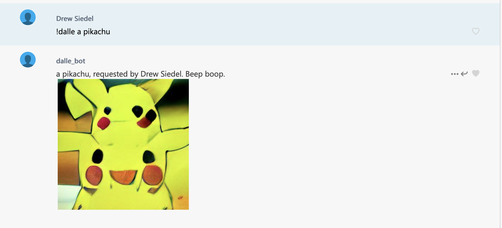

## Example

(No I don't know why it made a pikachu with two heads. Take it up with the creators of Dall-E :smile:).

## About
[Dall-E](https://openai.com/blog/dall-e/) is an OpenAI model, trained to generate images from a text description. It can create images of entirely new concepts, based on its understanding of the various parts of the prompt and the desired relationship.

[Dall-E Mini](https://wandb.ai/dalle-mini/dalle-mini/reports/DALL-E-mini-Generate-Images-from-Any-Text-Prompt--VmlldzoyMDE4NDAy) is an open-sourcem model that attempts to produce similar results with an open-source model. Notably, unlike OpenAI's Dall-E, the use of Dall-E Mini is publicly available. [This](https://huggingface.co/spaces/dalle-mini/dalle-mini) is a web-hosted version of the model, made by the creator. It is also possible to run your own version of the model.

[GroupMe](https://web.groupme.com/chats) is a group chat app that I happen to use with my friends. It has [a serviceable Developer API](https://dev.groupme.com/docs/v3).

This repo contains code to run a server that listens to messages in a GroupMe chat. When a message begins with `!dalle`, the server gathers the text of the message and sends it off to a self-hosted copy of Dall-E Mini, and posts the response back into the chat.

## Usage

 - Clone this repo. Install the `requirements.txt` packages into python, preferably in a virtual environment. Python 3.X required.
 - Set up your own copy of Dall-E Mini. To do so, go to https://github.com/saharmor/dalle-playground, and follow the instructions for spinning one up on Google Colab. Be sure to choose the "mini" size, if you want to be able to run it on the Colab free tier. Alternatively, you could follow the same steps on your own server if you don't want to have it hosted on Colab. Colab is probably easier, but (in my experience) will time you out periodically.
 - Set up an Application in GroupMe. The API docs contain instructions. This is required to get an authentication token for the v3 API.
 - Set up a GroupMe bot, either through `make_bot.py` (might need a little tweaking to work correctly) or manually through the GroupMe web interface. Make sure that the `callback_url` for the bot is pointing to `http://<YOUR_IP_OR_HOSTNAME>:<YOUR_PORT>/message`. Note that this is not the IP for your Dall-E server, but is the IP where you will be running the server for this bot.
 - Set and export environment variables required for our server. These include the ID of the bot you created, the GroupMe API token, and the URL of the Dall-E server.
 - Tweak the `GROUP_ID` variable in the code to point to the GroupMe group the bot is in. I should have made this an environment variable as well, but I made this for fun and don't feel like changing it now. This value isn't secret, so I don't mind that I checked it in here.
 - Run the server: `python groupme_server.py`. You should be able to see messages as they come in, and some loose debug text when a `!dalle` request is being processed.
